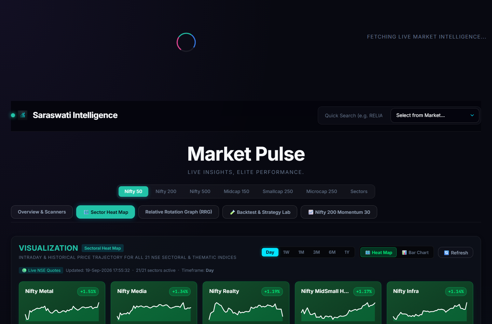
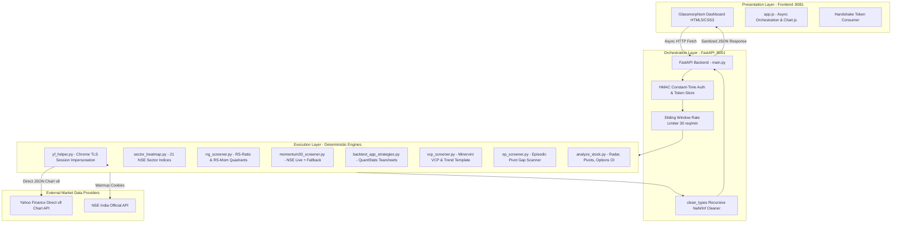

# 📈 Saraswati Stock Analyzer — Institutional Market Intelligence Platform

**An institutional-grade Indian equities intelligence, momentum screening, and algorithmic strategy backtesting platform engineered with FastAPI, modern JavaScript, and high-performance Python engines.**

[](https://python.org)
[](https://fastapi.tiangolo.com)
[](https://www.nseindia.com)
[](https://opensource.org/licenses/MIT)
[](https://github.com/piyushk20/saraswati-stock-analyzer)

---

## 📸 Dashboard Previews

### 1. Real-Time Market Overview & Technical Radar


### 2. Live Sectoral Heat Map (StockeZee-Style Sparklines)


---

## 👨‍💻 About Me

**Piyush Kumar**  
*Quantitative Developer, Algorithmic Trader & Full-Stack Systems Engineer*  
- **GitHub**: [@piyushk20](https://github.com/piyushk20)  
- **Repository**: [piyushk20/saraswati-stock-analyzer](https://github.com/piyushk20/saraswati-stock-analyzer)

### Vision & Philosophy
Saraswati Stock Analyzer was built to eliminate emotional bias from Indian stock market analysis. By fusing Mark Minervini's Trend Template, Anthony Saliba's options volatility dynamics, Julius de Kempenaer's Relative Rotation Graphs (RRG), and automated QuantStats tearsheet generation, the platform provides retail and prop traders with institutional-grade edge across the NSE 500 universe.

---

## 🏛️ System Architecture

Saraswati is structured upon an ultra-reliable **3-Layer Deterministic Architecture** designed to separate concerns, prevent rate limits, and ensure fault isolation:



### The 3 Core Layers

#### 1. Layer 1: Directives (Standard Operating Procedures)
- Lives in `directives/` and project documentation.
- Formulates trading models, risk bounds, and mathematical criteria (e.g. Minervini VCP depth constraints, RRG rolling window algorithms).

#### 2. Layer 2: Orchestration (FastAPI Server — `backend/main.py`)
- **Session Handshake (`/api/handshake`)**: Issues ephemeral 24-hour cryptographic session tokens (`secrets.token_hex(32)`) to browser clients so no raw API keys are ever exposed in static JavaScript.
- **Constant-Time Verification**: Direct API calls use `hmac.compare_digest` to prevent timing attacks.
- **Sliding-Window Rate Limiter**: 30 req/min per IP with auto-pruning to safeguard memory.
- **Fail-Safe Sanitization (`clean_types()`)**: Recursively purges `NaN`, `Infinity`, and NumPy types (`int64`, `ndarray`) to guarantee standard JSON serialization without browser "Failed to Fetch" anomalies.
- **Strict Input Validation**: Regex allowlists on symbols (`^[\w\^\.\-\&]{1,30}$`) and path-traversal prevention on HTML tearsheets via `Path(filename).name`.

#### 3. Layer 3: Execution (Deterministic Python Engines — `execution/`)
- **Chrome TLS Session Impersonation (`execution/yf_helper.py`)**: Uses `threading.local()` with `curl_cffi` browser impersonation to prevent Yahoo Finance 429 rate-limiting during large universe batch sweeps.
- **Direct v8 API Fallback**: Directly queries Yahoo Finance v8 JSON chart endpoints to bypass unreliable crumb/cookie dependencies.
- **Multi-Threaded Concurrency**: Throttled parallel workers (`ThreadPoolExecutor`) tuned to prevent Windows socket exhaustion (`WSAENOBUFS`).

---

## 🔥 Key Features & Technical Modules

| Feature / Scanner | Method / Algorithm | Data Source & Cadence |
| :--- | :--- | :--- |
| **🗺️ Sectoral Heat Map** | StockeZee-style visual cards & sorted horizontal bar charts for 21 NSE indices with dynamic SVG sparklines across Day, 1W, 1M, 3M, 6M, 1Y. | Live NSE / yfinance direct v8 |
| **🌀 Relative Rotation Graph (RRG)** | Calculates **JdK RS-Ratio** and **RS-Momentum** against NIFTY 50 / NIFTY 500 to segment assets into **Leading**, **Improving**, **Weakening**, and **Lagging** quadrants. | Daily & hourly resampled closes |
| **📈 Nifty 200 Momentum 30** | Ranks official top 30 momentum constituents from the Nifty 200 universe with real-time percentage changes and sector attribution. | NSE India live API + fallback |
| **🧪 Strategy Backtesting Lab** | Systematic historical simulation (Golden Cross, Multi-TF RSI, Episodic Pivot, VCP) with full **QuantStats** HTML tearsheet generation (Sharpe, CAGR, Max Drawdown). | 5-year historical bars |
| **🚩 Perfect Flag Screener** | Minervini Stage 2 uptrend, tight pullback (<15% depth), flagpole regression ($R^2 > 0.8$), volume dry-up contraction. | NSE 500 Daily Bars |
| **⚡ Multi-Timeframe RSI** | Confluence momentum filter: Monthly RSI > 60, Weekly RSI > 60, and Daily RSI strictly between 55–65. | Multi-period EOD sweeps |
| **🔥 Episodic Pivot (EP)** | Earnings/catalyst gap scanner: Gap-up $\ge 6.5\%$, Relative Volume (RVOL) $\ge 2.0\times$, Stage 2 SMA alignment. | Intraday & historical bars |
| **📐 Minervini VCP** | Volatility Contraction Pattern identification with progressive handle contractions ($\le 10\%$) and 52W High proximity ($\ge 75\%$). | Trend Template screening |
| **📊 Options Chain OI** | Put-Call Ratio (PCR), Max Pain strikes, ATM Straddle pricing, and institutional open interest distributions. | Live derivative quotes |

---

## 📂 Project Directory Structure

```text
indianstock/
├── backend/
│   ├── main.py                     # FastAPI orchestrator with hardened security & CORS
│   └── requirements.txt            # Backend dependencies
├── execution/                      # Deterministic analytical & screening engines
│   ├── yf_helper.py                # Chrome-impersonated session & direct v8 chart API
│   ├── sector_heatmap.py           # 21 NSE sectoral heatmap data engine & sparklines
│   ├── rrg_screener.py             # Relative Rotation Graph RS-Ratio & Mom engine
│   ├── momentum30_screener.py      # Nifty 200 Momentum 30 live scanner
│   ├── backtest_app_strategies.py  # QuantStats strategy backtest & tearsheet generator
│   ├── analyze_stock.py            # Comprehensive technical radar, pivots, options chain
│   ├── vcp_screener.py             # Minervini VCP & Stage 2 trend template
│   ├── ep_screener.py              # Episodic Pivot gap & volume surge engine
│   ├── rsi_screener.py             # Multi-timeframe RSI momentum screener
│   ├── screener.py                 # SMA 50/200 Golden & Death cross detection
│   └── market_overview.py          # Market pulse, indices, gainers/losers & smart money flow
├── frontend/                       # Institutional Dark-Mode Glassmorphism Dashboard
│   ├── index.html                  # HTML5 interface with tab navigation
│   ├── app.js                      # Reactive controllers, Chart.js, and session handshake
│   ├── style.css                   # Custom CSS variables, animations, and responsive grids
│   └── config.example.js           # Frontend environment configuration template
├── backtest_results/               # Generated strategy backtest summary & HTML tearsheets
│   ├── backtest_summary.json       # Structured benchmark statistics
│   └── tearsheets/                 # Interactive QuantStats reports for each stock/strategy
├── screenshots/                    # UI captures & visual previews
│   ├── dashboard.png               # Main dashboard overview capture
│   └── sector_heatmap.png          # Sectoral Heat Map capture
├── ind_nifty500list.csv            # Official Nifty 500 constituent universe
├── run_app.py                      # Multi-process server runner with automated restart
├── CLAUDE.md / GEMINI.md           # AI Agent SOP instructions & persistent memory
└── README.md                       # Documentation & architecture specifications
```

---

## 🚀 Quickstart & Setup

### 1. Prerequisites
- **Python 3.10+** (Tested up to Python 3.12)
- Modern web browser (Chrome, Edge, Firefox, Brave)

### 2. Installation
Clone the repository and install requirements in a virtual environment:
```powershell
# Clone the repository
git clone https://github.com/piyushk20/saraswati-stock-analyzer.git
cd saraswati-stock-analyzer

# Create and activate virtual environment
python -m venv .venv
.\.venv\Scripts\Activate.ps1

# Install dependencies
pip install -r requirements.txt
```

### 3. Environment Configuration
Create a `.env` file in the root directory:
```env
API_KEY=sk_saraswati_YOUR_SECURE_RANDOM_KEY_AT_LEAST_40_CHARS_LONG
```

### 4. Launching the Platform

#### Option A: Unified Launcher (Recommended)
Launches both FastAPI backend (`http://127.0.0.1:8001`) and the static frontend (`http://127.0.0.1:8081`) with automated process monitoring:
```powershell
python run_app.py
```

#### Option B: Manual Launch
```powershell
# Terminal 1: Backend Server
cd backend
python -m uvicorn main:app --host 127.0.0.1 --port 8001 --reload

# Terminal 2: Frontend Server
cd frontend
python -m http.server 8081
```

Once running, navigate to **[http://127.0.0.1:8081](http://127.0.0.1:8081)** in your browser.

---

## 🔒 Security & Performance Guidelines

- **Origin Isolation**: CORS is locked strictly to localhost frontend development ports (`8081`, `8082`, `8085`).
- **Cryptographic Session Tokens**: No master API keys are transmitted across unauthenticated channels.
- **Hardened HTTP Headers**: Implements `X-Content-Type-Options: nosniff`, `X-Frame-Options: DENY`, `Strict-Transport-Security`, and strict Content Security Policies (`CSP`).
- **Memory Safety**: Screeners utilize bounded deques and time-to-live (`TTL`) cache dictionaries to maintain minimal RAM usage during persistent runs.

---

## 📄 License

This project is licensed under the **MIT License** — see the [LICENSE](LICENSE) file for details.

© 2026 **Piyush Kumar** ([@piyushk20](https://github.com/piyushk20)). Engineered for high-conviction market research.
